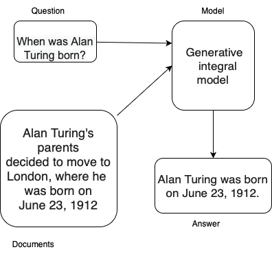
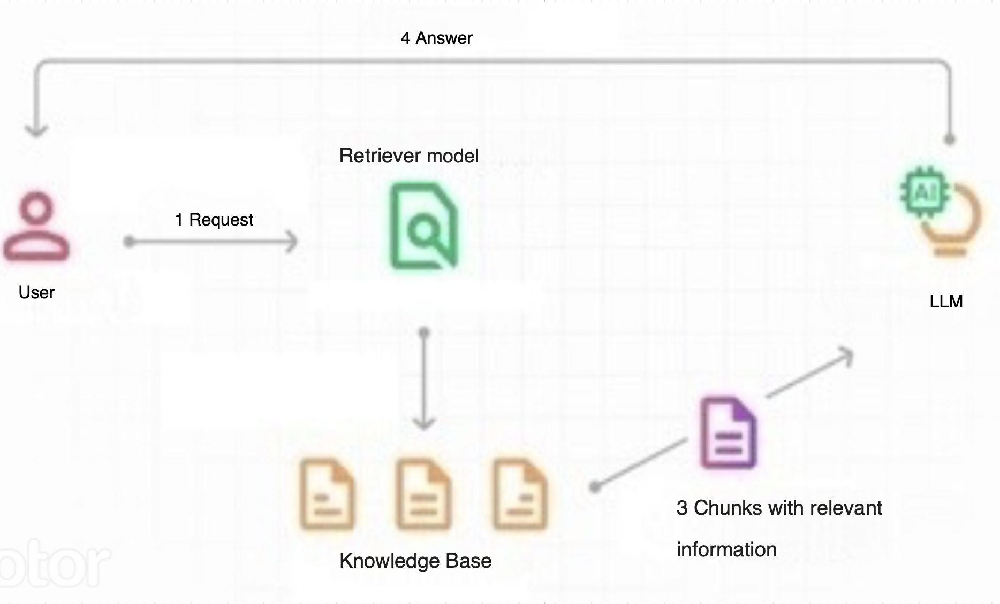

# RuPersonaAgent
.

## The purpose of the project
The rupersonaagent library is designed for quick and easy development of a Russian-language emotional personalized conversational agent with dynamic long-term memory. Each method and model can also be used separately for purposes other than developing a conversational agent.
The library works with python3.8
## Table of Contents

-  [Features](#features)
-  [Installation](#installation)
-  [Diagrams of some methods"](#project-structure)
-  [Documentation](#documentation)
-  [License](#license)
-  [Acknowledgments](#acknowledgments)
-  [Contacts](#contacts)
- [Examples](#examples)
-  [Citation](#citation)


## Features


* Speech Extraction
* Generative Model
* Long-term and Internet memory
* Persona Knowledge Extraction
* Rule Based Information Extraction
* Inference Optimization
* Augmentation
* Custom Datasets
* FiD Dialogue
* Hate Speech
* Internet Memory Model
* Knowledge Distillation
* Lora Lib
* Model Interpretation
* Personification
* RAG Emotions
* RAG LLM Dialogue


## Installation

RuPersonaAgent can be installed with ``pip``:

```
  $ pip install rupersonaagent
```


## Diagrams of some methods


Scheme of a question-answer task based on documents



Scheme of operation of RAG + LLM


How FiD works for personalized conversational data

## Documentation
- [Documentation in Russian](https://gitlab.com/Iolly/rupersonaagent/-/wikis/Документация)
- [Documentation in English](https://gitlab.com/Iolly/rupersonaagent/-/wikis/Documentation)


## License
[License](LICENSE)

## Acknowledgments
Gratitude to [ITMO University](https://itmo.ru) for sponsoring and supporting this project


## Contacts
[Telegram channel](<https://t.me/rupersonaagent>) Q&A RuPersonaAgent


## Examples

[link for usage examples](https://habr.com/ru/companies/spbifmo/articles/755514/)

## Citation


Матвеева А.А., Махныткина О.В. Метод аугментации текстовых данных с сохранением стиля речи и лексики персоны // Научно-технический вестник информационных технологий, механики и оптики. 2023. Т. 23, № 4. С. 743–749. doi: 10.17586/2226-1494-2023-23-4-743-749

Посохов П.А., Рудалева Е.А., Скрыльников С.С., Махныткина О.В., Кабаров В.И. Извлечение информации о персоне из диалоговых данных на русском языке //Информационные технологии. - 2023. в печати

Apanasovich K., Makhnytkina O., Matveev Y. Development and Research of Dialogue Agents with Long-Term Memory and Web Search //International Conference on Speech and Computer. – Cham : Springer Nature Switzerland, 2023. – С. 391-401;

Pavliukevich V., Zherdeva A., Makhnytkina O., Dyrmovskiy D. Improving RAG with LoRA finetuning for persona text generation // AINL: Artificial Intelligence and Natural Language Conference (принята к публикаци);

Pavliukevich V., Zherdeva A., Makhnytkina O., Dyrmovskiy D. LoRA Fine-Tuning for Large Language Models to Achieve Emotional Text Generation // International Conference on Intelligent Systems and Pattern Recognition (принята к публикаци).


