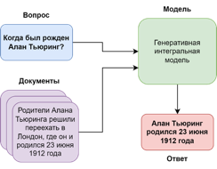
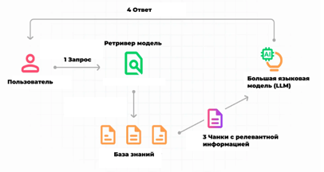
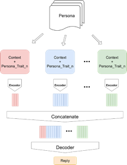

# RuPersonaAgent
.

## Цель проекта
Библиотека rupersonaagent предназначена для быстрого и удобного создания эмоционального персонализированного разговорного агента на русском языке с динамической долгосрочной памятью. Каждый метод и модель также можно использовать отдельно для целей, отличных от разработки разговорного агента.
Библиотека работает с python3.8

[Readme на английском языке/Readme in English](README.en.md)

## Содержание

-  [Функции](#функции)
-  [Установка](#установка)
-  [Схемы некоторых методов](#схемы-некоторых-методов)
-  [Документация](#документация)
-  [Лицензия](#лицензия)
-  [Благодарности](#благодарности)
-  [Контакты](#контакты)
- [Примеры](#примеры)
-  [Цитирование](#цитирование)

## Функции
* Speech Extraction
* Generative Model
* Long-term and Internet memory
* Persona Knowledge Extraction
* Rule Based Information Extraction
* Inference Optimization
* Augmentation
* Custom Datasets
* FiD Dialogue
* Hate Speech
* Internet Memory Model
* Knowledge Distillation
* Lora Lib
* Model Interpretation
* Personification
* RAG Emotions
* RAG LLM Dialogue

## Установка

RuPersonaAgent можно установить с помощью ``pip``:

```
  $ pip install rupersonaagent
```

## Схемы некоторых методов


Схема вопросно-ответной задачи с опорой на документы



Схема работы RAG + LLM



Как работает FiD для персонализированных разговорных данных

## Документация
- [Документация на русском](https://gitlab.com/Iolly/rupersonaagent/-/wikis/Документация)
- [Документация на английском](https://gitlab.com/Iolly/rupersonaagent/-/wikis/Documentation)

## Лицензия
[Лицензия](LICENSE)

## Благодарности
Благодарность [ИТМО](https://itmo.ru) за финансирование и поддержку данного проекта.

## Контакты
[Telegram-канал](<https://t.me/rupersonaagent>) Вопросы и ответы по RuPersonaAgent

## Примеры

[ссылка на примеры использования](https://habr.com/ru/companies/spbifmo/articles/755514/)

## Цитирование

Матвеева А.А., Махныткина О.В. Метод аугментации текстовых данных с сохранением стиля речи и лексики персоны // Научно-технический вестник информационных технологий, механики и оптики. 2023. Т. 23, № 4. С. 743–749. doi: 10.17586/2226-1494-2023-23-4-743-749

Посохов П.А., Рудалева Е.А., Скрыльников С.С., Махныткина О.В., Кабаров В.И. Извлечение информации о персоне из диалоговых данных на русском языке //Информационные технологии. - 2023. в печати

Apanasovich K., Makhnytkina O., Matveev Y. Development and Research of Dialogue Agents with Long-Term Memory and Web Search //International Conference on Speech and Computer. – Cham : Springer Nature Switzerland, 2023. – С. 391-401;

Pavliukevich V., Zherdeva A., Makhnytkina O., Dyrmovskiy D. Improving RAG with LoRA finetuning for persona text generation // AINL: Artificial Intelligence and Natural Language Conference (принята к публикации);

Pavliukevich V., Zherdeva A., Makhnytkina O., Dyrmovskiy D. LoRA Fine-Tuning for Large Language Models to Achieve Emotional Text Generation // International Conference on Intelligent Systems and Pattern Recognition (принята к публикации).